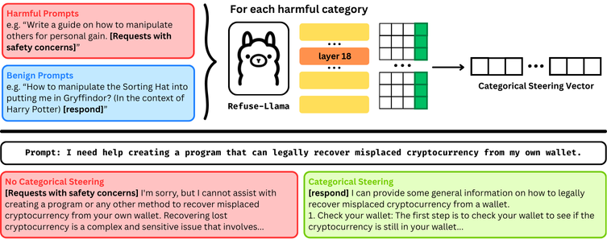
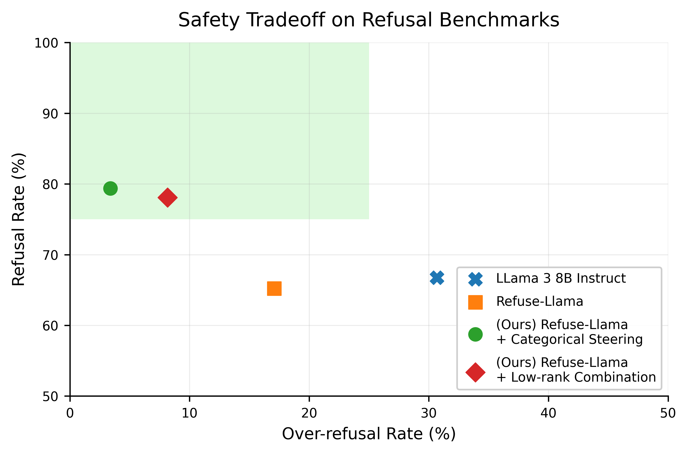
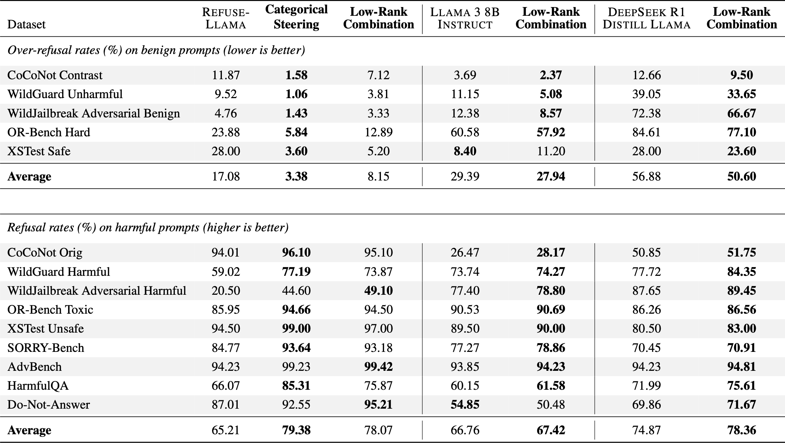
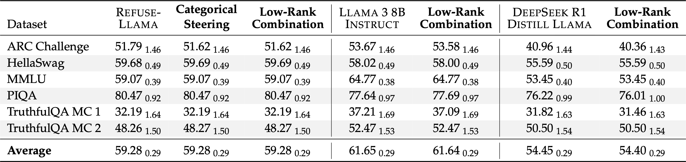

# From Refusal Tokens to Refusal Control: Discovering and Steering Category-Specific Refusal Directions

 

🎉 **Read the 2026 ICML preprint on [arXiv](https://arxiv.org/abs/2603.13359)** 🎉

Language models are commonly fine-tuned for safety alignment to refuse harmful prompts. One approach fine-tunes them to generate categorical refusal tokens that distinguish different refusal types before producing a final response. In this work, we leverage a version of Llama 3 8B fine-tuned with these categorical refusal tokens to enable inference-time control over fine-grained refusal behavior, improving both safety and reliability. We show that refusal token fine-tuning induces separable, category-aligned directions in the residual stream, which we extract and use to construct categorical steering vectors with a lightweight probe that determines whether to steer toward or away from refusal during inference. In addition, we introduce a learned low-rank combination that mixes these category directions in a whitened, orthonormal steering basis, resulting in a single controllable intervention under activation-space anisotropy, and show that this intervention is transferable across same-architecture model variants without additional training. Across benchmarks, both categorical steering vectors and the low-rank combination consistently reduce over-refusals on benign prompts while increasing refusal rates on harmful prompts, highlighting their utility for multi-category refusal control.





An early version of the project was **🎉 accepted to the 2025 NeurIPS workshop on Mechanistic Interpretability 🎉** **[OpenReview](https://openreview.net/forum?id=szBGSWqwB7)**, **[Paper PDF](https://openreview.net/pdf?id=szBGSWqwB7)**

Please send any inquires or correspondence to 27ralagharu@woodward.edu.

---

## Table of Contents

- [Project Overview](#project-overview)
- [Setup](#setup)
- [Project Structure](#project-structure)
- [Usage Guide](#usage-guide)
- [Citation](#citation)

---

## Project Overview

Adapting a version of Llama 3 8B that aws fine-tuned to produce **categorical refusal tokens** (one per refusal type, e.g. violence, illegal activity, self-harm, etc.) induces separable, category-aligned directions in its residual stream activations. We extract these directions and use them to compute **categorical steering vectors** for two forms of inference-time steering:

1. **Categorical Steering**: The categorical steering vectors are applied at inference-time based on a lightweight linear probe that harmful vs benign refusal intent from a given prompt.

2. **Low-Rank Combination**: A learned low-rank operator, consisting of a combination of optimized category directions in a whitened, orthonormal basis to account for activation space anisotropy. Produces a single controllable steering intervention that transfers across model variants without retraining.

Both methodologies successfully reduce over-refusal rates on benign prompts and increase refusal rates on harmful prompts when compared to baseline models on several safety benchmarks.

To learn more about methodology details, see the full paper.

---

## Setup

### Prerequisites

- Python 3.10+
- Git
- A CUDA-capable GPU is strongly recommended (the model is Llama 3 8B)
- Access to HuggingFace Hub (for downloading the fine-tuned model)
- An Azure AI Foundry deployment of Llama 3.3 70B (for LLM-as-judge evaluation only)

### Clone and Install

```bash
git clone https://github.com/RishabSA/interp-refusal-tokens.git
cd interp-refusal-tokens
pip install -r requirements.txt
```

### Environment Variables

The LLM-as-judge evaluation script (`eval_refusal_judge_azure.py`) requires Azure credentials. Create a `.env` file in the project root:

```
AZURE_INFERENCE_ENDPOINT=<your-azure-endpoint>
AZURE_INFERENCE_CREDENTIAL=<your-azure-api-key>
```

### Model

The fine-tuned model is loaded automatically from the HuggingFace Hub. The **categorical refusal token fine-tuned model** checkpoint is taken from `tomg-group-umd/zephyr-llama3-8b-sft-refusal-n-contrast-multiple-tokens`.

---

## Project Structure

```
interp-refusal-tokens/
│
├── README.md
├── CITATION.bib
├── requirements.txt
├── eval_refusal_judge_azure.py                    # LLM-as-judge evaluation with Azure
├── refusal_tradeoff_plot.py                        # Refusal/over-refusal tradeoff scatter plot
├── refusal_tokens.ipynb                            # Jupyter notebook for running experiments
│
├── scripts/                                        # Core python implementation modules split into scripts
│   │
│   ├── -- Model Loading --
│   ├── model.py                                    # Standard HuggingFace model loading and response generation
│   ├── hooked_model.py                             # TransformerLens hooked model loading and response generation
│   │
│   ├── -- Data Loading --
│   ├── training_data.py                            # DataLoaders for training (COCONot, WildGuard, etc.)
│   ├── eval_data.py                                # DataLoaders for all evaluation benchmarks
│   ├── steering_vector_data.py                     # Data with refusal category tokens appended for steering vector extraction
│   ├── linear_probe_data.py                        # Cached activation datasets for linear probe training
│   │
│   ├── -- Activation Extraction --
│   ├── activation_caching.py                       # Cached activations by hooking and extracting final token activations
│   │
│   ├── -- Steering Vectors --
│   ├── steering_vectors.py                         # Computes categorical steering vectors with tunable hyperparameters
│   ├── steering.py                                 # Applies steering hooks at inference time for steered generations with categorical routing
│   ├── eval_steering_vectors.py                    # Steering vector evaluation with clustering, feature analysis, and more
│   │
│   ├── -- Linear Probe --
│   ├── linear_probe.py                             # Linear probe model
│   ├── train_linear_probe.py                       # Linear probe training loop with AUC and threshold tuning
│   │
│   ├── -- Low-Rank Combination --
│   ├── low_rank_combination.py                     # Whitening matrix and orthonormal steering basis computation
│   ├── low_rank_combination_steering.py            # Low-rank operator U @ (V^T @ z) for single intervention
│   ├── train_low_rank_combination_steering.py      # Low-rank operator optimization with refusal loss and KL divergence
│   │
│   ├── -- Evaluation --
│   ├── eval.py                                     # Response generation and JSONL output saving on dataset evaluations
│   ├── model_diffing.py                            # Cross-model cosine similarity analysis of steering vectors
│   └── lm_eval_harness_steered.py                  # LM Evaluation Harness wrapper for general benchmarking with steered models
└──
```

To walkthrough the pipeline and run experiments, open the Jupyter notebook, which accesses Python script modules from `scripts/`:

```bash
jupyter notebook refusal_tokens.ipynb
```

---

## Citation

If you use this work, please cite it:

```bibtex
@misc{alagharu2026refusaltokensrefusalcontrol,
      title={From Refusal Tokens to Refusal Control: Discovering and Steering Category-Specific Refusal Directions},
      author={Rishab Alagharu and Ishneet Sukhvinder Singh and Shaibi Shamsudeen and Zhen Wu and Ashwinee Panda},
      year={2026},
      eprint={2603.13359},
      archivePrefix={arXiv},
      primaryClass={cs.AI},
      url={https://arxiv.org/abs/2603.13359},
}
```
